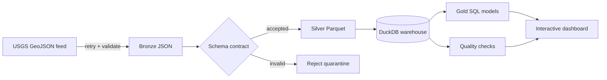

# QuakeFlow

[](https://github.com/kdlin/quakeflow/actions/workflows/ci.yml)
[](https://github.com/kdlin/quakeflow/actions/workflows/dashboard.yml)
[](https://www.python.org/)
[](https://duckdb.org/)

**A production-style earthquake data lakehouse that turns the live USGS GeoJSON feed into validated Parquet, analytics-ready DuckDB models, quality reports, and an interactive global dashboard.**

## [Open the live dashboard](https://kdlin.github.io/quakeflow/)

QuakeFlow is intentionally more than a notebook. It demonstrates the mechanics expected in a real data platform: resilient extraction, immutable raw storage, schema enforcement, rejected-record quarantine, idempotent loading, dimensional aggregates, data contracts, pipeline observability, automated testing, and scheduled deployment.

## Architecture



## Engineering features

- **Incremental and idempotent:** USGS event IDs are primary keys, so reruns update events instead of duplicating them.
- **Medallion layers:** Exact source payloads land in bronze, validated records in Zstandard-compressed silver Parquet, and business metrics in gold SQL views.
- **Data contracts:** Invalid geometry, timestamps, IDs, and numeric fields are quarantined as JSON Lines with a rejection reason.
- **Data quality:** Automated uniqueness, null, geographic-bound, magnitude, depth, and freshness checks.
- **Observability:** Every run records timing, feed, extracted/accepted/rejected counts, status, and errors.
- **Resilient extraction:** Bounded exponential backoff and explicit source identification.
- **Automated delivery:** GitHub Actions tests Python 3.12 and 3.13, refreshes the live feed every six hours, and deploys GitHub Pages.
- **Zero credentials:** The pipeline uses the public real-time feed recommended by USGS for automated applications.

## Warehouse models

| Layer | Asset | Purpose |
| --- | --- | --- |
| Bronze | Partitioned GeoJSON | Immutable source audit trail |
| Silver | Partitioned Parquet | Validated, typed event records |
| Warehouse | `earthquakes` | Deduplicated event-level source of truth |
| Gold | `gold_daily_metrics` | Daily volume, magnitude, depth, tsunami, and felt metrics |
| Gold | `gold_region_metrics` | Regional activity and severity |
| Gold | `gold_magnitude_distribution` | Magnitude-band distribution |
| Ops | `pipeline_runs` | Run lineage and operational metadata |
| Ops | `quality_results` | Check-level data-quality history |

## Run locally

```powershell
git clone https://github.com/kdlin/quakeflow.git
cd quakeflow
python -m venv .venv
.venv\Scripts\Activate.ps1
pip install -e ".[dev]"
quakeflow run --feed all_week
```

Open `docs/index.html` in a browser to explore the generated dashboard.

Other commands:

```powershell
quakeflow quality
quakeflow stats --limit 15
quakeflow dashboard
pytest
ruff check .
```

Available feeds are `all_hour`, `all_day`, `all_week`, and `significant_month`.

## Repository structure

```text
quakeflow/
├── src/quakeflow/       Pipeline, contracts, warehouse, quality, and dashboard
├── sql/                 Warehouse schema and gold transformations
├── tests/               Unit and end-to-end idempotency tests
├── data/                Git-ignored bronze, silver, rejects, and DuckDB layers
├── docs/                Generated static dashboard for GitHub Pages
└── .github/workflows/   CI and scheduled dashboard deployment
```

## Data source

Earthquake data comes from the [U.S. Geological Survey real-time GeoJSON feeds](https://earthquake.usgs.gov/earthquakes/feed/v1.0/geojson.php). USGS recommends these feeds for automated applications that display earthquake information.

## License

[MIT](LICENSE)
